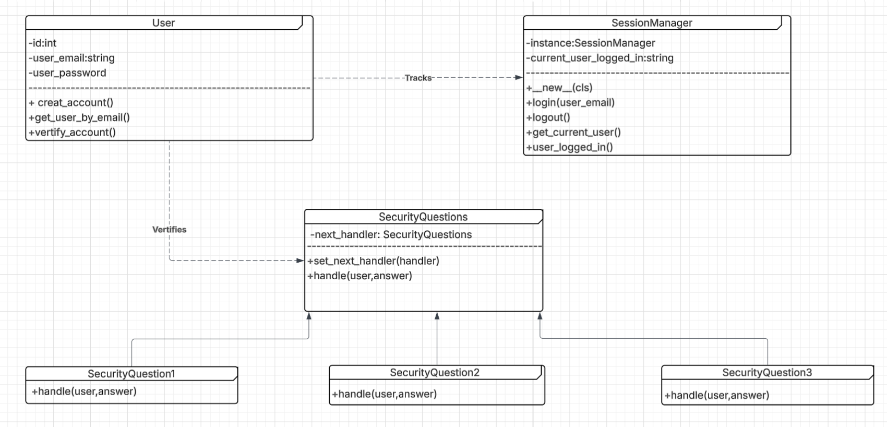
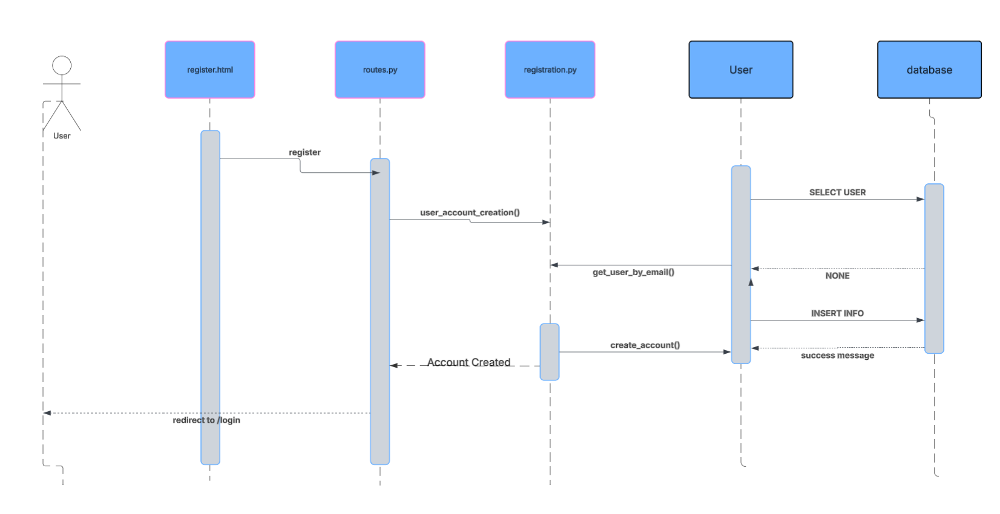
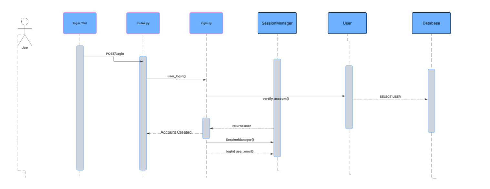
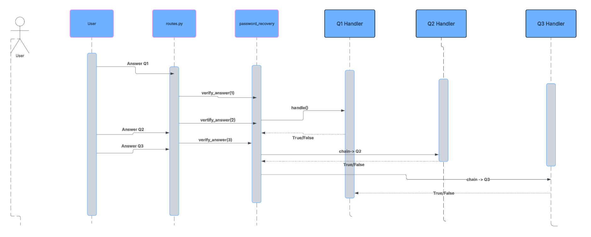
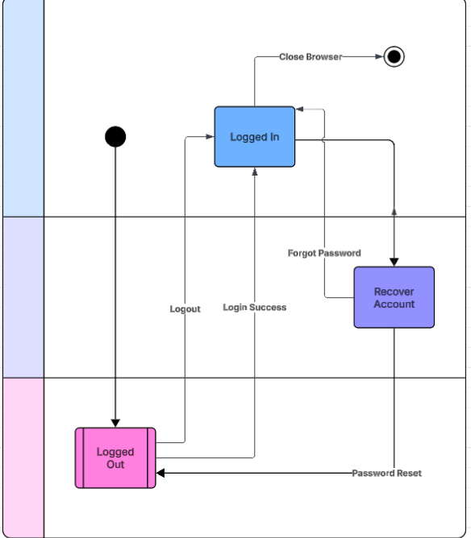

Diagram 1: Class Diagram(User)
Description: This class diagram shows the structure of the authencation module for our Driveshare. 
It contains three main parts, The user class which stores the user information, the session manager class which 
is the singleton, tracks the current logged in user across the entire application. Last we have the 
Security questions which is our abstract class along with its three concrete subclasses which forms
the Chain for password recovery. 

Diagram 2: Sequence Diagram(User Registration):
Description: Traces the flow of a new user registering. The form data goes from register.html -> routes.py -> registration.py, which checks if the email exists, then calls User.create_account() to hash the password and insert the new user into the database.

Diagram 3: Sequence Diagram(User Logging in)
Description:Shows the login process and demonstrates the Singleton pattern. When login.py calls SessionManager(), the same single instance is returned every time, so the user's session is consistently tracked across the entire application.

Diagram 4: Sequence Diagram(Chain)
Description: This diagram shows the Chain of Responsibility pattern. The user answers three security questions one at a time. Each question is handled by its own handler, linked to the next_handler. The chain continues as each answer is verified, but ONLY after all three questions pass can the user reset their password.

Diagram 5: 
Description: Shows the three possible states of a user session: Logged Out, Logged In, and Recovering Password. Transitions happen on login, logout, forgot password, wrong answer, or successful password reset. The Singleton SessionManager tracks which state the session is in.

